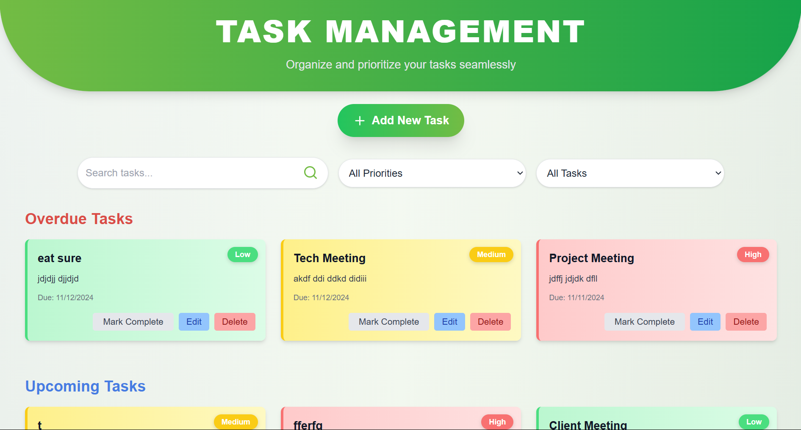
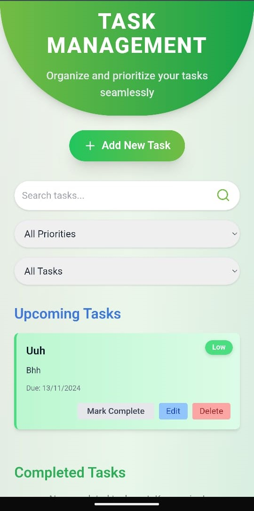

# Task Management Application

A simple task management application built with **Next.js** and **Tailwind CSS**. This project allows users to add, edit, delete, and mark tasks as complete. Tasks are categorized as overdue, upcoming, or completed, making it easy for users to manage their time and priorities.

## Demo

Check out the live demo of the application here: [Task Management App Demo](https://task-management-app-rust.vercel.app/)

## Features

- **Add New Task:** Users can add tasks with a title, description, due date, and priority level.
- **Edit/Delete Task:** Users can edit or delete tasks as needed.
- **Mark Task as Complete:** Tasks can be marked as complete, moving them to the "Completed Tasks" section.
- **Filter & Search:** Users can filter tasks by priority and completion status, and search for specific tasks by keywords.
- **Overdue Handling:** Overdue tasks are displayed prominently for better task management.

## Technologies Used

- **Next.js**: `v15.0.3` – For creating the React-based web application framework.
- **React**: `v19.0.0-rc-66855b96-20241106` – For building user interfaces.
- **React DOM**: `v19.0.0-rc-66855b96-20241106` – For DOM-specific methods for React.
- **React Icons**: `v5.3.0` – For simple, clean icons to enhance the UI.
- **Tailwind CSS**: `v3.4.1` – For styling and responsive design.
- **Node.js**: `v20.17.0` – For the runtime environment.
- **ESLint**: `v8.x` – For linting and enforcing coding standards.
- **PostCSS**: `v8.x` – For processing CSS files.

## Setup Instructions

1. **Clone the Repository**
   ```bash
   git clone https://github.com/umeshbhatiya143/task-management-app.git
   cd task-management-app
2. **Install Dependencies Make sure you have Node.js v20.17.0 and npm installed, then run:**
   ```bash
   npm install
3. **Run the Development Server Start the local development server:**
    ```bash
    npm run dev
    Open http://localhost:3000 to view the app in the browser.
4. **Build the Application (Optional) For production, build the application:**
    ```bash
    npm run build

## Screenshots



*The task management application in desktop view, showcasing the task list, filters, and the ability to manage tasks.*



*The task management application in mobile view, optimized for smaller screens and easy task management on the go.*

## Assumptions

1. **Overdue Tasks Display**: Overdue tasks should always be visible if they are incomplete, regardless of the selected filter or search term.
2. **Filter Logic**:
    - The "All" filter displays all tasks.
    - The "Completed" filter shows only completed tasks.
    - The "Incomplete" filter shows only upcoming or overdue incomplete tasks.
    - Overdue tasks are prioritized and shown at the top when applicable.
3. **Priority Filter**:
    - Tasks are filtered by the priority level set during creation or editing (Low, Medium, High).
4. **Search Functionality**: Search results display any tasks with titles or descriptions that contain the search term, irrespective of their completion status.
5. **Styling and Responsiveness**: Tailwind CSS is used to ensure responsiveness across devices, with a focus on usability and aesthetics. The application is **fully responsive**, providing an optimized user experience on both desktop and mobile devices.

## Additional Information

- **Responsive Design**: The application is styled to be **fully responsive**, ensuring functionality across various screen sizes, from desktop to mobile devices.
- **Task Data Management**: Task data is temporarily managed in **local storage** to persist tasks even after the user reloads or closes the application. This allows users to maintain their task list across sessions without needing a database.
- **Color Scheme**: The application uses a variety of color schemes, including the color scheme of **#73BC44, black, and white**, to ensure a visually cohesive and appealing design.
- **Priority-Based Colors**: Tasks are color-coded based on their priority level (Low, Medium, High) for quick visual identification. For example:
  - **Low Priority**: Green (#73BC44)
  - **Medium Priority**: Yellow
  - **High Priority**: Red


## Future Improvements

* **Persistent Storage**: Implement database support (e.g., MongoDB) for saving tasks persistently.
* **User Authentication**: Add user authentication to allow personalized task management.
* **Notifications**: Integrate notifications for upcoming or overdue tasks.

